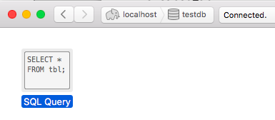

# Postgres Queries

Great Resource:

https://www.w3schools.com/sql/default.asp

<h1>Exercise One</h1>

* In Postico, you can write your own queries by click here:

* Lets create a users table in our testdb database with the following columns:
	* id
	* name
	* email
	* password
	* created_at
	* updated_at
	* num_logins
	* is_email_address_confirmed
* Lets create a products table in our testdb database with the following columns:
	* Pair up and help each other create a products table
	* Include the columns id, name, price, is_in_stock, sku
	* SKU is unique ID for product, can contain letters and numbers
	* Assign the correct data type to each column
	* Assign a PRIMARY KEY (auto incrementing)
	* Assign a UNIQUE KEY to the appropriate column
	* Reference the users table for tips

<h1>Exercise Two</h1>

* Develop a database diagram for one of your favorite websites.
* Start with the users table and go from there!
* Be sure to indicate the relationships between different tables in the database
* You could use www.draw.io or a pen and paper

